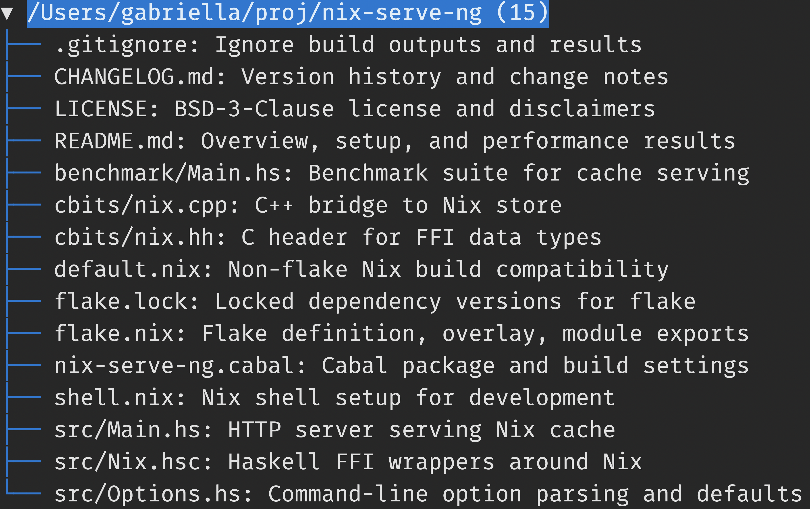
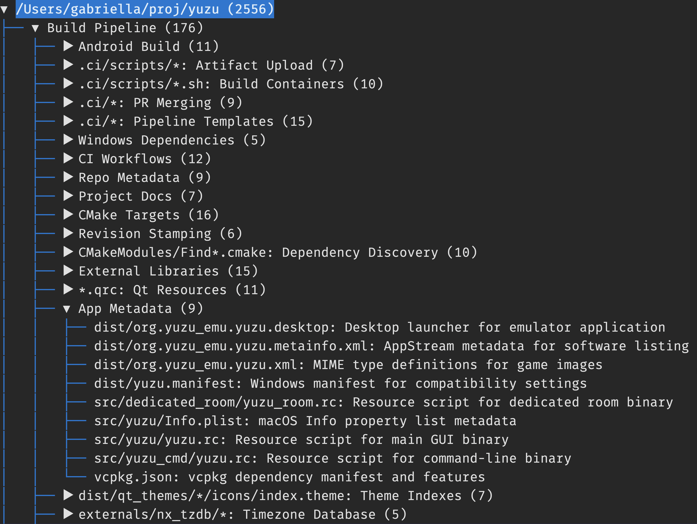
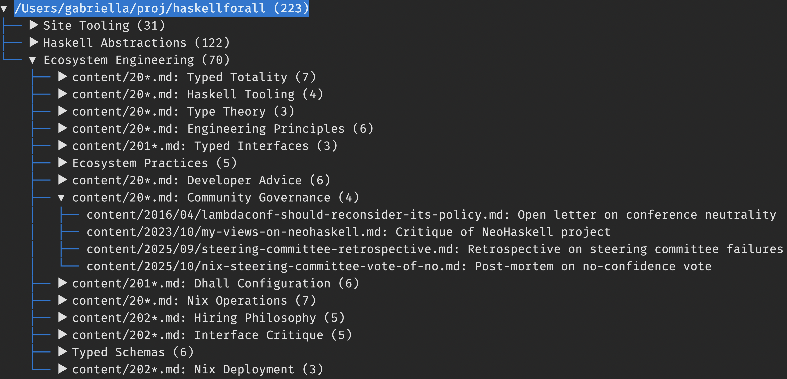

# Semantic project navigator

Introductory blog post about this tool: [Browse code by meaning](https://haskellforall.com/2026/02/browse-code-by-meaning).

This project provides a tool that lets you browse a repository's files
by their meaning:

https://github.com/user-attachments/assets/95f04087-453d-413e-8661-5bcd7dce4062


## Setup

Currently I've only built and run this script using uv and Nix.  However, you
can feel free to submit pull requests for other installation instructions if
you've vetted them.

No matter what you do you will need to provide an `OPENAI_API_KEY` environment variable in
order to use this script:

```ShellSession
$ export OPENAI_API_KEY="$(< ./path/to/openai.key)"
```

### uv

You can run the script in a single command, like this:

```ShellSession
$ uvx git+https://github.com/Gabriella439/semantic-navigator ./path/to/repository
```

… or you can install the script:

```ShellSession
$ uv tool install git+https://github.com/Gabriella439/semantic-navigator

$ semantic-navigator ./path/to/repository
```

### Nix

You can run the script in a single command, like this:

```ShellSession
$ nix run github:Gabriella439/semantic-navigator -- ./path/to/repository
```

… or you can build the script and run it separately:

```ShellSession
$ nix build github:Gabriella439/semantic-navigator

$ ./result/bin/semantic-navigator ./path/to/repository
```

… or you can install the script:

```ShellSession
$ nix profile install github:Gabriella439/semantic-navigator

$ semantic-navigator ./path/to/repository
```

## Usage

Depending on the size of the project it will probably take between a few
seconds to a minute to produce a tree viewer.  Most of this delay is due to
using `gpt-5-mini` by default to label clusters because `gpt-5-mini` has worse
latency[^1], but is cheaper and still generally gives good results.  If you're
willing to pay 7× as much to use a snappier and better model you can do this:

```ShellSession
$ semantic-navigator --completion-model gpt-5.2 ./path/to/repository
```

For small repositories (up to 20 files) you won't see any clusters and the tool
will just summarize the individual files:



This is a tradeoff the tool makes for ergonomic reasons: the tool avoids
subdividing clusters with 20 files or fewer.

For a a medium-sized repository you'll begin to see top-level clusters:


The label for each cluster describes the files within that cluster and will
also display a file pattern if all files within the cluster begin with the same
prefix or suffix.  In the above example the "Project Prelude" doesn't display a
file pattern because there is no common prefix or suffix within the cluster,
whereas the "Condition Rendering" cluster displays a file pattern of
`*/Condition.dhall` because both files within the cluster share the same
suffix.

For an even larger repository you'll begin to see nested clusters:



On a somewhat modern MacBook this tool can handle up to ≈10,000 files within a
few minutes.

You can use this tool on any text documents; not just code!  For example,
here's the result when running the tool on the repository for my self-hosted
blog:



In other words, this tool isn't just a code indexer or project indexer; it's a
general file indexer.

## Development

If you use Nix and `direnv` this project provides a `.envrc` which
automatically provides a virtual environment with all the necessary
dependencies (both Python and non-Python dependencies).

Otherwise if you don't use `direnv` you can enter the virtual environment using:

```ShellSession
$ nix develop
```

… and you can test any of the setup commands with a local checkout by replacing
`github:Gabriella439/semantic-navigator` with `.`, like this:

```ShellSession
$ nix run . -- ./path/to/repository
```

[^1]: OpenAI advertises `gpt-5-mini` as faster than `gpt-5*` models, but I see significantly worse latency for completions requests using `gpt-5-mini` which  matters more for this project's purposes.  The completions model is only being used to generate short labels where inference throughput does not matter that much.                                                                          
